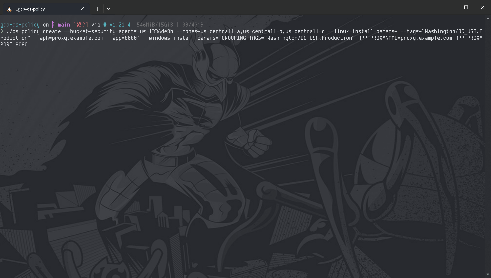

# cs-policy

A helper tool for deploying CrowdStrike OS Poilcies to GCP Zones. This tool automates many of the manual steps required to create & deploy OS Policies to GCP VMs.

The tool does the following:

- Downloads the N-1 version of the CrowdStrike Falcon Sensor
- Uploads the CrowdStrike Falcon Sensors to the GCP Storage Bucket of your choice
- Generates a OS Policy template for your environment
- Creates a OS Policy Assignment in the GCP Zones of your choice



## Supported Operating Systems

The CrowdStrike OS Policy currently supports the following operating systems:

| Operating System                                         | Architecture  |
| -------------------------------------------------------- | ------------- |
| Red Hat Enterprise Linux 6                               | x86_64        |
| Red Hat Enterprise Linux 7                               | x86_64        |
| Red Hat Enterprise Linux 8                               | x86_64        |
| Red Hat Enterprise Linux 9                               | x86_64        |
| CentOS 6                                                 | x86_64        |
| CentOS 7                                                 | x86_64        |
| CentOS 8                                                 | x86_64        |
| SUSE Linux Enterprise Server 11                          | x86_64        |
| SUSE Linux Enterprise Server 12                          | x86_64        |
| SUSE Linux Enterprise Server 15                          | x86_64        |
| Ubuntu 16.04                                             | x86_64        |
| Ubuntu 18.04                                             | x86_64        |
| Ubuntu 20.04                                             | x86_64        |
| Ubuntu 22.04                                             | x86_64        |
| Debian 9                                                 | x86_64        |
| Debian 10                                                | x86_64        |
| Debian 11                                                | x86_64        |
| All Windows Versions supported by the CrowdStrike Sensor | x86_64        |

> Note: For supported Windows versions, check the CrowdStrike documentation.

## Requirements

- CrowdStrike API Keys with the `Sensor Download` scope
- [gcloud cli](https://cloud.google.com/sdk/gcloud) installed
- Project with VM Manager setup
- GCP permissions to create OS Policy Assignments and upload files to the target GCP Storage Bucket

### GCP VM Manager

OS Policy is a feature of GCP VM Manager. In order to use OS Policies to deploy the CrowdStrike Falcon Sensor, you must setup VM Manager. See the [GCP VM Manager documentation](https://cloud.google.com/compute/docs/vm-manager) for more information about VM Manager and how to set it up.

### Generate API Keys

1. In the CrowdStrike console, navigate to **Support and resources** > **API Clients & Keys**. Click **Add new API Client**.
2. Add the following api scopes:

    | Scope               | Permission | Description                                                                  |
    | ------------------- | ---------- | ---------------------------------------------------------------------------- |
    | Sensor Download     | *READ*     | Allows the tool to download the sensor and grab your CID from the CrowdStrike API.      |

3. Click **Add** to create the API client. The next screen will display the API **CLIENT ID**, **SECRET**, and **BASE URL**. You will need all three for the next step.

    <details><summary>picture</summary>
    <p>

    

    </p>
    </details>

> Note: This page is only shown once. Make sure you copy **CLIENT ID**, **SECRET**, and **BASE URL** to a secure location.

## Installation

[Download release binaries](https://github.com/CrowdStrike/gcp-os-policy/releases/latest) that match your platform

## Usage

1. Authenticate with the gcloud CLI.

    ```bash
    gcloud auth application-default login
    ```
> Note: There are other ways to authenticate with GCP like using a service account. Use whichever method is best for your environment. The `cs-policy` tool will find the credentials and use them.
2. Set the project to the project you want to deploy the OS Policies to.

    ```bash
    gcloud config set project cs-policy
    ``` 
3. OPTIONAL: Export the CrowdStrike API keys as environment variables. Alternatively you can provide the keys as command line arguments.

    ```bash
    export FALCON_CLIENT_ID=********
    export FALCON_CLIENT_SECRET=********
    export FALCON_CLOUD=********
    ```
4. Run the tool.

    ```bash
    cs-policy create --bucket=example-bucket --zones=us-central1-a,us-central1-b --linux-install-params='--tags="Washington/DC_USA,Production" --aph=proxy.example.com --app=8080' --windows-install-params='GROUPING_TAGS="Washington/DC_USA,Production" APP_PROXYNAME=proxy.example.com APP_PROXYPORT=8080'
    ```

    Use the `--help` flag to see all available options and more examples.

    ```bash
    cs-policy --help
    ```

